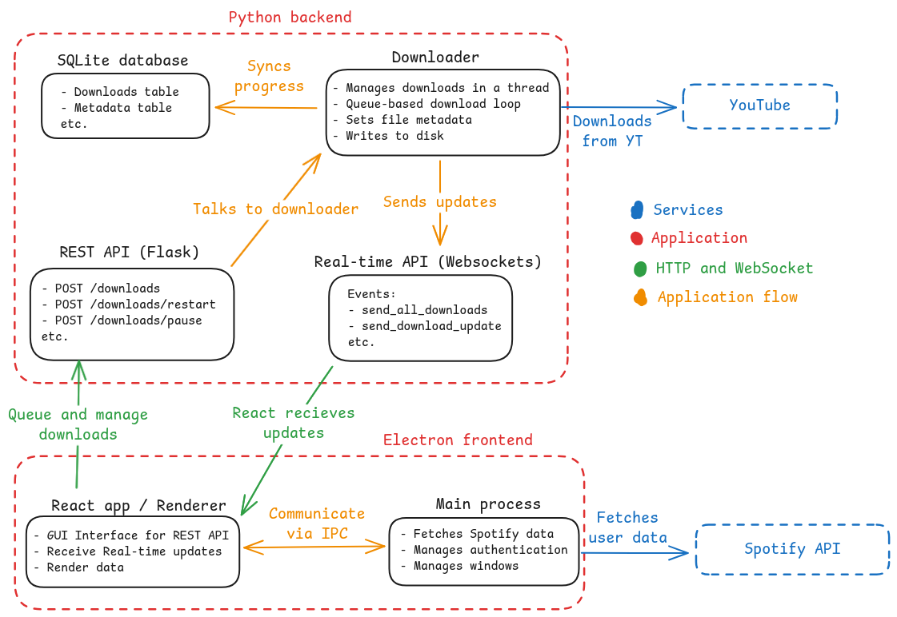
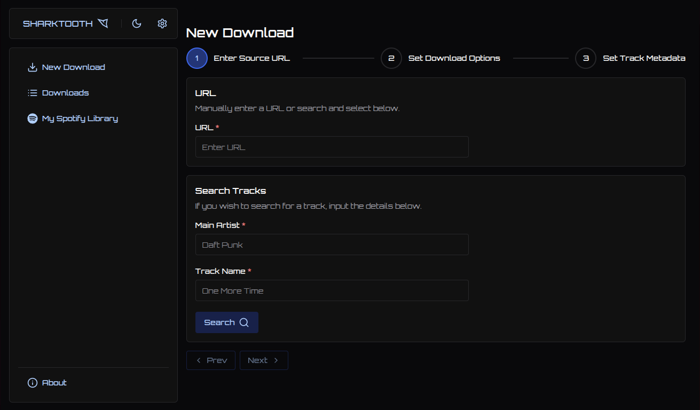
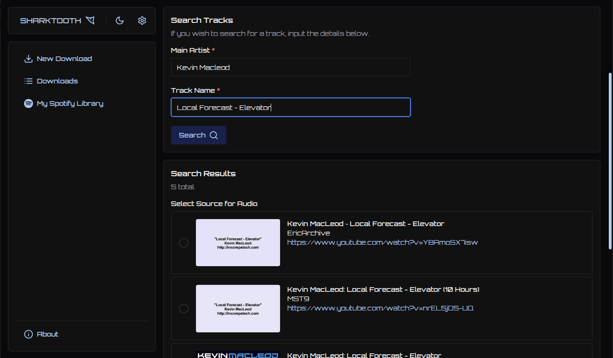
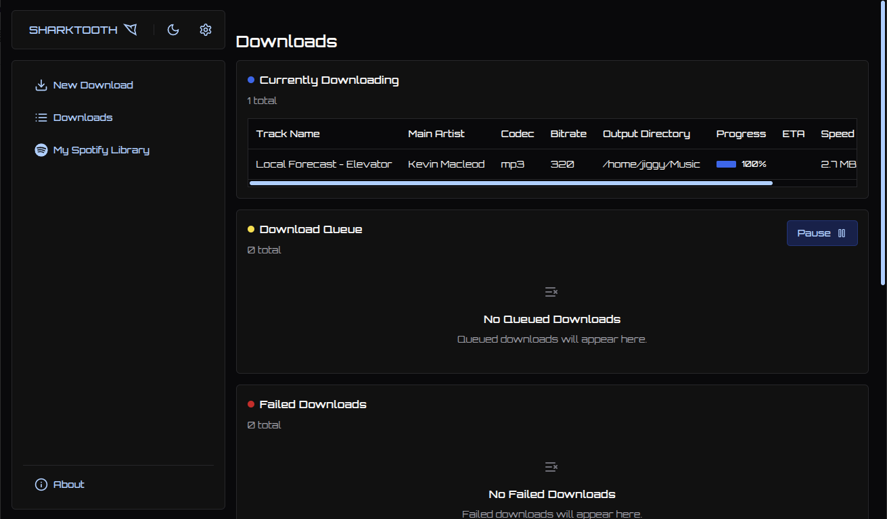
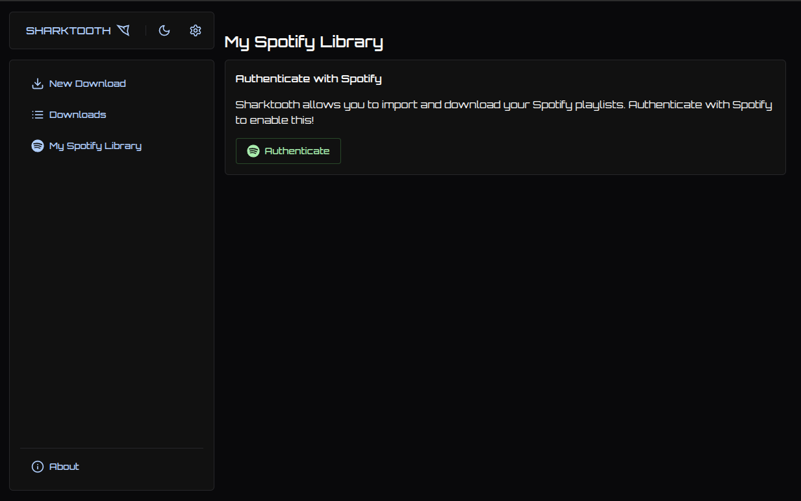

  
   

  <h1>Sharktooth</h1>

  

  
  
  

  

    
    
    
    
    
    
    
  

## About

Sharktooth is a feature-rich music downloader desktop application. You can download audio from YouTube in a range of different audio codecs such as mp3, flac, and so on. You can also authenticate with Spotify and download your Spotify music library and playlists into m3u8 or XML files. Sharktooth aims to

### Disclaimer

Users are responsible for their actions and potential legal consequences. I do not support unauthorized downloading of copyrighted material and take no responsibility for user actions. This project is mainly for the download of public domain tracks and to demonstrate, as well as exercise, the core engineering and architecture that goes into applications that require media processing.

## Features

- Search for audio tracks or paste a YouTube URL to download.
- Set file metadata such as track artist, name, album, release date and more before download.
- A queue based downloads system with real-time updates and
  CRUD operations.
- Integration with the Spotify API in order to download tracks as well as playlist metadata into m3u8 or XML files.
- Highly configurable global application and download settings.

## Roadmap

Sharktooth is currently in development and yet to be released however I anticipate that I will have a minimum viable product (MVP) that I am happy with by early 2026 and as a result v1.0.0.

## Architecture

The project is architected as a full-stack desktop application with an Electron frontend built using React and TypeScript, and a Python Flask backend running locally on the user’s machine as part of the application. This separation offloads heavy download and file management tasks to a backend service that operates on the user’s system. The backend exposes both RESTful and real-time WebSocket APIs, enabling communication with the frontend for status updates, progress tracking, and dynamic task management.

The backend is a download management system designed around concurrency and data persistence. Downloads are processed via a threaded queue-based loop, allowing multiple tasks to be scheduled, paused, or resumed without blocking the main Flask application. Each download’s metadata, progress, and history are tracked using an SQLite database, providing local persistence for session restoration and history tracking.

The frontend talks to the backend using a combination of REST endpoints for commands (e.g., start, pause, queue, or cancel downloads) and real-time WebSocket events for continuous updates on progress, errors, and task completion. The main process in the electron app also talks to the Spotify API feeding data to the renderer via IPC.

Below you can see a diagram that illustrates this architecture:

## Screenshots

## License

[MIT](https://opensource.org/license/mit)
